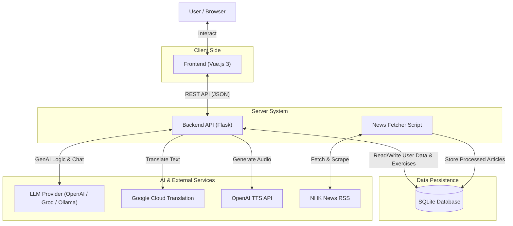
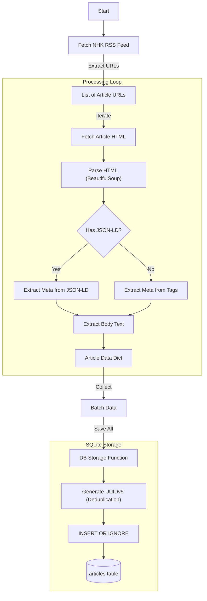
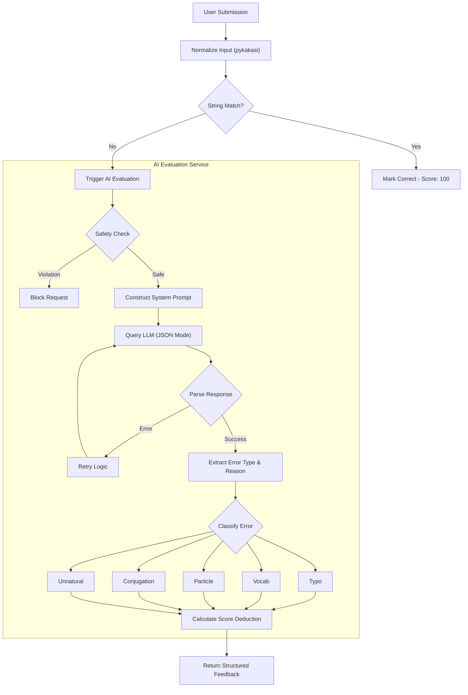
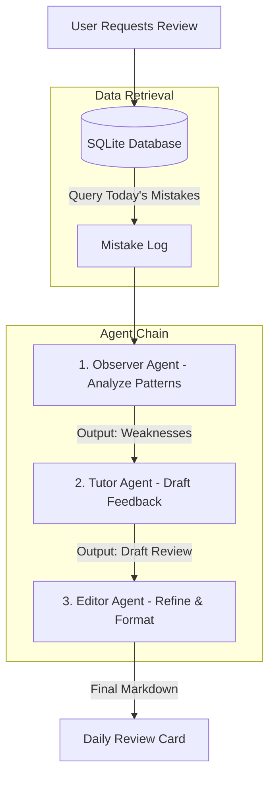
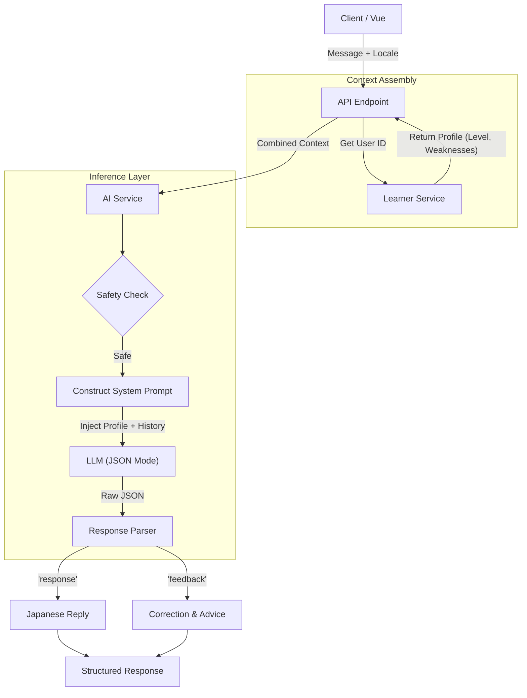

# 栞 (Shiori)

**An AI-powered Japanese learning system built around real-world reading and adaptive tutoring.**

栞 (Shiori) is an advanced prototype developed as part of an academic course, focusing on **system design**, **natural language processing**, and **practical integration of large language models** in an educational setting.
The project explores how deterministic NLP techniques and LLM-based reasoning can be combined to provide **meaningful feedback**, not just correctness scores, for Japanese language learners.

---

## 🎯 Project Motivation

Many Japanese learning tools rely heavily on:

* Artificial example sentences
* Binary right/wrong feedback
* Isolated drills disconnected from real usage

However, real Japanese—as encountered in news, articles, and conversation—is **contextual, ambiguous, and nuanced**.

**Shiori addresses this gap by:**

* Using **real-world news content** as the primary learning material
* Providing **explanatory feedback** that identifies *why* an answer is incorrect
* Adapting AI behavior based on each learner’s proficiency and historical weaknesses

---

## ✨ Core Capabilities

### 📰 Real-World Reading

* Ingests the latest NHK news articles
* Automatic **furigana generation** and sentence segmentation
* Articles stored locally to support repeat reading and analysis

### ✍️ Hybrid Grammar & Usage Evaluation

* Combines **rule-based string matching** with **LLM-based semantic evaluation**
* Detects error categories such as:

  * Particle misuse
  * Conjugation errors
  * Vocabulary choice issues
  * Contextually unnatural expressions
* Returns structured, human-readable explanations instead of generic corrections

### 💬 Adaptive AI Tutor

* AI chat partner conditioned on the learner’s:

  * JLPT level
  * Common error patterns
* Adjusts vocabulary difficulty and sentence complexity dynamically
* Responds in Japanese while explaining mistakes in the user’s interface language

### 🔁 Mistake Review & Learning Analytics

* Tracks incorrect answers over time
* Aggregates accuracy by:

  * Part of speech (POS)
  * JLPT level
* Provides visual statistics to help learners focus on weak areas

### 👩‍🏫 Agent-Generated Daily Review

* A multi-step AI agent analyzes the learner’s daily mistakes
* Produces a personalized study summary similar to a private tutor’s feedback
* Outputs structured Markdown with clear sections and examples

---

## 🏗 System Architecture & Workflow

This project places strong emphasis on **explicit system logic and data flow**, in line with course requirements.

### High-Level Architecture

* **Frontend:** Vue 3 single-page application
* **Backend:** Flask REST API
* **Database:** SQLite for persistent storage
* **AI Layer:** Model-agnostic LLM interface supporting multiple providers



---

### News Ingestion Pipeline

Located in `tools/news_fetcher.py`.

**Workflow:**

1. Fetches articles from NHK RSS feeds
2. Parses HTML content and extracts structured data
3. Generates UUIDs from article URLs to prevent duplication
4. Stores cleaned articles in SQLite



---

### Exercise Evaluation State Machine

The following diagram represents a **state machine**, where transitions depend on validation outcomes and AI safety checks.

Located in `apps/backend/ai_service.py`.

**Evaluation Flow:**

1. User submits an answer
2. Deterministic check:

   * Converts both answer and reference to hiragana using `pykakasi`
   * Performs strict string comparison
3. If mismatch:

   * LLM evaluates semantic correctness
   * Classifies error type (typo, particle, conjugation, etc.)
4. Returns structured JSON feedback



---

### Agentic Daily Review Workflow

The agent pipeline is modeled as a **Directed Acyclic Graph (DAG)**, where each agent consumes the output of the previous stage.

Located in `apps/backend/agent_service.py`.

**Three-stage agent pipeline:**

1. **Observer** – Queries incorrect answers and categorizes error patterns
2. **Tutor** – Drafts an educational, learner-friendly review
3. **Editor** – Refines output into structured Markdown



---

### Personalized AI Chat

Located in `apps/backend/ai_service.py` and `apps/backend/learner_service.py`.

**Chat Pipeline:**

1.  **Context Loading** – Fetches user's JLPT level and weak points from `learner_profiles`.
2.  **Prompt Engineering** – Dynamically constructs a system instruction that:
    *   Enforces the user's preferred language for explanations (Locale).
    *   Sets the complexity of Japanese output (N5~N1).
    *   Focuses corrections on specific weaknesses.
3.  **JSON-Mode Inference** – Forces the LLM to output separated conversation and feedback.



---

## 🧠 Key Technical Design Decisions

* **Hybrid Evaluation Approach**
  Pure LLM evaluation can be inconsistent, while rule-based systems lack flexibility.
  Shiori combines both to achieve robustness and explainability.

* **Model-Agnostic AI Layer**
  The system abstracts LLM providers, allowing seamless switching between:

  * OpenAI-compatible APIs
  * Ollama-style local inference
  * Groq for low-latency or safety checks

* **SQLite by Design**
  Chosen intentionally for simplicity, transparency, and ease of inspection in an academic context.

* **Locale-Aware Feedback**
  Separates *target language output* (Japanese) from *instructional language* (e.g., English, Traditional Chinese).

---

## 🛠 Tech Stack

### Frontend

* Vue.js 3 (Composition API)
* Vite
* TypeScript
* Tailwind CSS
* Pinia
* Vue Router
* Vue I18n
* Chart.js / vue-chartjs

### Backend

* Python (Flask)
* SQLite
* `pwdlib` (Argon2 password hashing)
* `janome` (Japanese morphological analysis)
* `pykakasi` (Kana conversion)
* BeautifulSoup4 (web scraping)

### AI & External Services

* Primary model: `openai/gpt-oss-120b`
* LLM Providers:

  * Lab API (Ollama-compatible)
  * Groq API (OpenAI SDK–compatible)
* Google Cloud Translation API
* OpenAI Text-to-Speech (`tts-1`)

---

## 📂 Project Structure

```bash
.
├── apps
│   ├── backend
│   │   ├── ai_service.py
│   │   ├── agent_service.py
│   │   ├── learner_service.py
│   │   ├── translation_service.py
│   │   ├── tts_service.py
│   │   └── app.py
│   └── frontend
│       ├── src
│       │   ├── components
│       │   ├── stores
│       │   └── views
│       └── vite.config.ts
├── data
│   └── news_corpus.db
└── tools
    ├── news_fetcher.py
    └── exercise_generator.py
```

---

## 🚀 Setup & Installation

### Prerequisites

* Node.js (v18+)
* Python (3.10+)
* Google Cloud credentials (Translation API)
* OpenAI API key

### Backend

```bash
cd apps/backend
python -m venv venv
source venv/bin/activate
pip install -r requirements.txt
cp .env.example .env
python ../../tools/news_fetcher.py
python app.py
```

Backend runs on `http://localhost:5000`

### Frontend

```bash
cd apps/frontend
npm install
npm run dev
```

Frontend runs on `http://localhost:5173`

---

## 🔌 API Overview

| Method | Endpoint                | Description                             |
| ------ | ----------------------- | --------------------------------------- |
| GET    | `/api/news`             | List processed news articles            |
| GET    | `/api/news/<id>`        | Article details and segmented sentences |
| POST   | `/api/chat/send`        | Context-aware AI tutor chat             |
| POST   | `/api/exercise/submit`  | Hybrid exercise evaluation              |
| GET    | `/api/statistics/<uid>` | Learner analytics                       |
| POST   | `/api/tts`              | Generate Japanese audio                 |

---

## 🛡 Security Considerations

* Passwords hashed with Argon2 via `pwdlib`
* LLM safety checks performed using a dedicated safeguard model
* Input validation enforced before AI processing

---

## 🤝 Contributing

This project was developed primarily for academic purposes, but contributions are welcome—especially in areas such as:

* UI/UX improvements
* Additional news sources
* Enhanced error classification logic
* Automated testing

---

## 🎓 Academic & Technical Objectives

This project demonstrates:
- **Practical application of NLP techniques** for Japanese (Morphological Analysis, Kana Conversion)
- **Hybrid AI system design** combining deterministic logic with probabilistic LLM reasoning
- **Explicit modeling of system logic** via State Machines and Directed Acyclic Graphs (DAGs)
- **Separation of concerns** across Frontend, Backend, Data, and AI Services
- **Agentic Workflow** implementation using multi-stage LLM chains (Observer-Tutor-Editor)